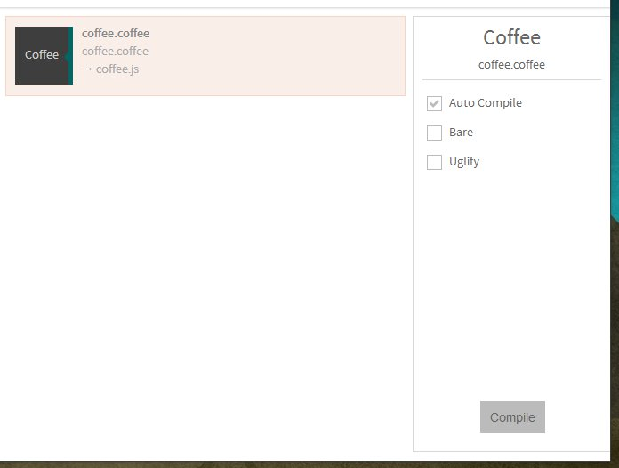

You can compile coffee-script files with Prepros.

If you save less files in `coffee` folder the compiled output will be saved in your `js` folder.

You can configure default `css`, `js`, and `html` folders from [project options](projects.html)

You can learn more about Coffee-script on [Coffee-Script website](http://coffeescript.org/).