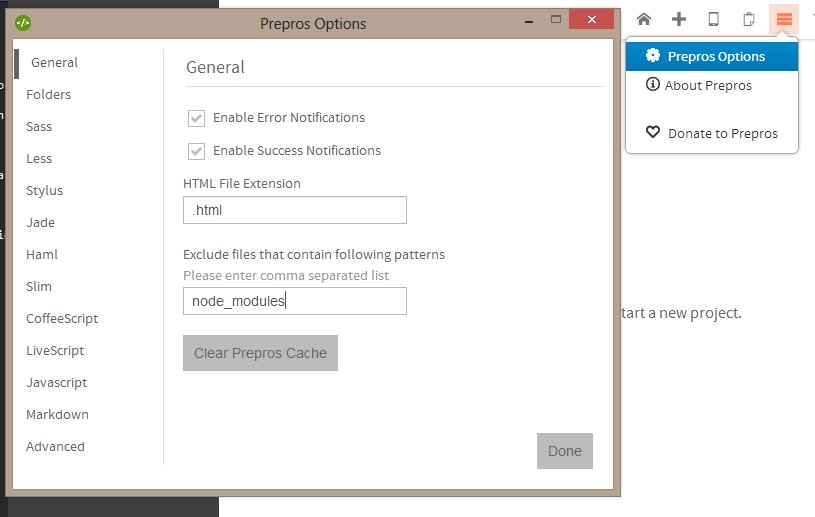
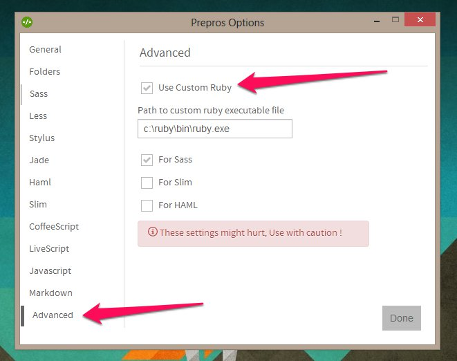

Prepros has lots of options to customize it for your needs.

You can open options window by clicking on the menu icon on the top right corner of the app window and then clicking the Prepros options option.

You can configure default options for files that are located in different tabs.

### Using Custom Ruby

To use custom ruby you have to install ruby and required gems like sass, compass, slim and haml on your system and then point Prepros to use that ruby.

First go to the advanced tab of Prepros options windows and click the use custom ruby checkbox and then if you are on windows enter the path to ruby exe file and Select the languages that you want to use custom ruby for.

File and folder options apply only to newer projects
