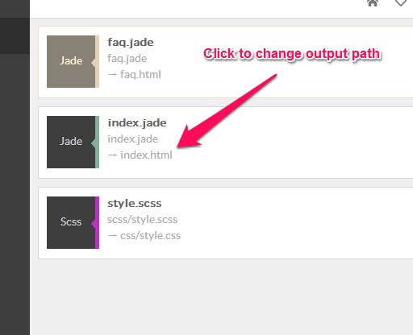
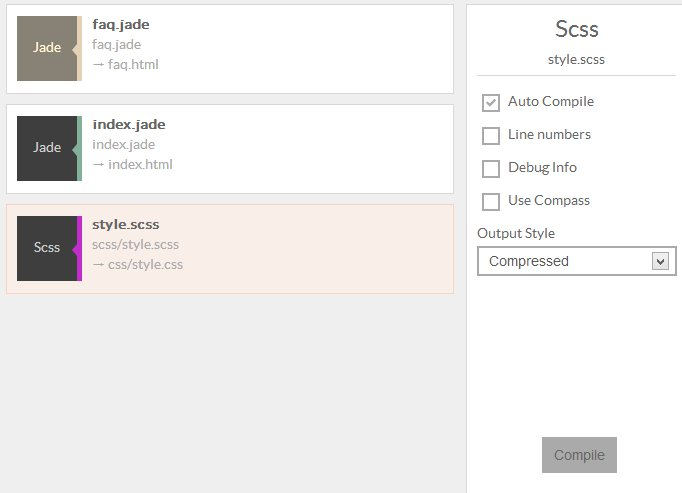

Prepros shows all the files it can compile in the files list.

If a file is imported by another file the imported file is not shown in the files list but the imported file is watched on the background and parent file is compiled whenever change is made to the imported file.

Files that have auto compile disabled have different monochrome thumbnails.

_Output can't be changed if file requires full [compass](sass-compass.html) support._

### Changing File Options

You can click on file to show file options pannel on the right side of the app window.

The above image shows the file options panel for a sass files. You can see options for other languages by clicking the file.

You can also default file options from [options window](config.html) before adding project.

You can also click the compile button or hit `CTRL+C` to compile file manually.

You can also compile all files in the selected project by hitting `CTRL+SHIFT+C` on your keyboard.

You can double click file to open with your default editor.

