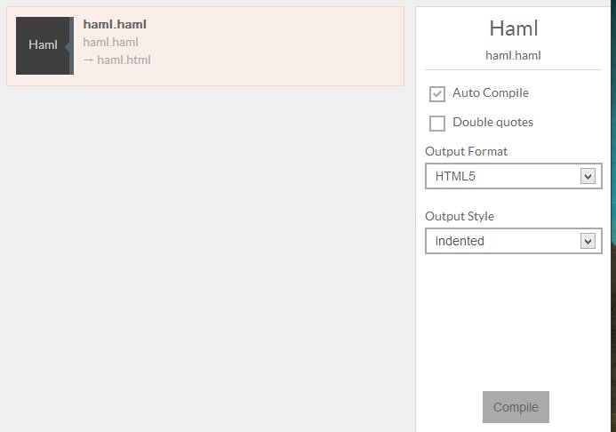

You can compile Haml files with Prepros.

If you save Haml files in `haml` folder the compiled output will be saved in your `html` folder.

You can configure default `css`, `js`, and `html` folders from [project options](projects.html).

You can learn more about Haml on [Haml website](http://haml.info).