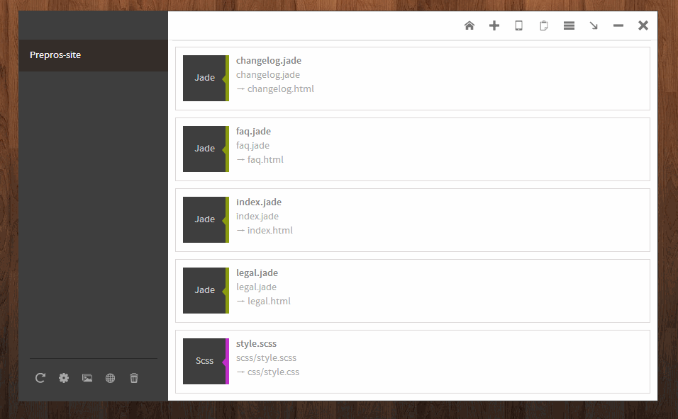

Prepros can optimize your png, jpg, gif images to speed up the page load time and keep your site fast.

Right click the project and click the image optimization option on the context menu to show up the image optimization screen. You can also click on the image icon on the bottom left side of the Prepros window.

Click on the optimize button then Prepros will optimize the image.

  
<iframe width="640" height="480" src="//www.youtube.com/embed/pSbDjIlVv5Q" frameborder="0" allowfullscreen></iframe>  
