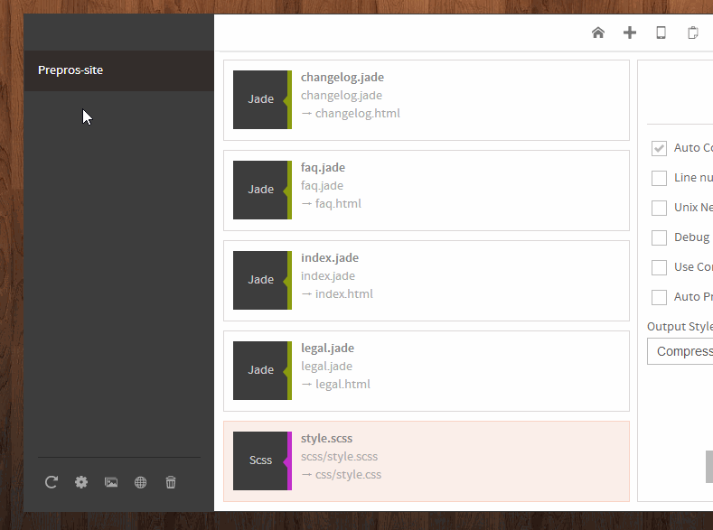

Prepros can live refresh your browser whenever a change is made to your file.

Live refresh works in Firefox, Chrome, Opera and IE10 if you are using built in http server.

You can live refresh custom server via Chrome extension or become [pro user](/prepros/pro) user which allows to refresh other browsers and [multiple devices](multi-device-testing.html)

Prepros uses websockets for communication so your browser must it for the live refresh to work.

You have to click on the `globe` icon on the project toolbar to open live url with built in http server. You can also hit `CTRL+L` to open the live url of the selected project.

## Using custom server

If you are using custom setup like apache or any other server you have to change the live refresh url from the [projects options panel](projects.html).

Open projects options panel by clicking the gears icon in the project toolbar and go to general tab. Check the use custom server checkbox and enter your custom url you want to refresh. Note: Don't forget the `http` or `https` protocol before the url.

