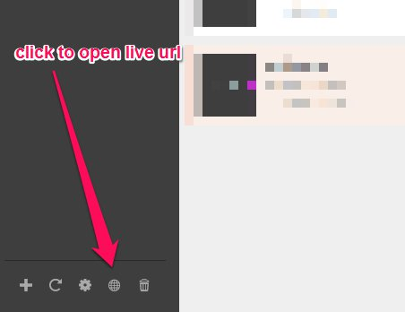
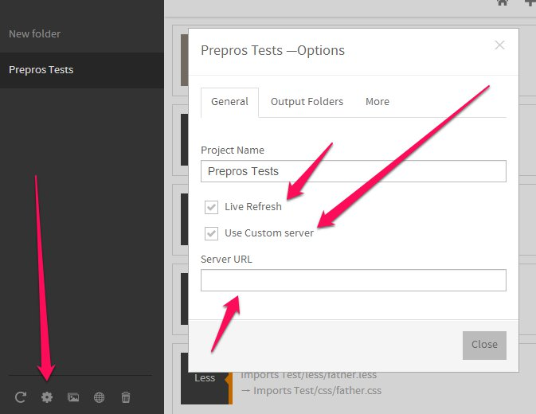

Prepros can live refresh your browser whenever a change is made to your file.

You have to first [install](installing.html) browser extension for the live refresh to work.

If you open file directly in the browser from file system ~~~ the live refresh won't work ~~~ (It works from version 2.0). You have to click on the `globe` icon on the project toolbar to open live url with built in http server. You can also hit `CTRL+L` to open the live url of the selected project.

## Using custom server

If you are using custom setup like apache or any other server you have to change the live refresh url from the [projects options panel](projects.html).

Open projects options panel by clicking the cog icon in the project toolbar and go to general tab. Check the use custom server checkbox and enter your custom url you want to refresh. Note: Don't forget the `http` or `https` protocol before the url.

Please enable `allow access to file url` option for Prepros chrome extension from chrome extensions page.
