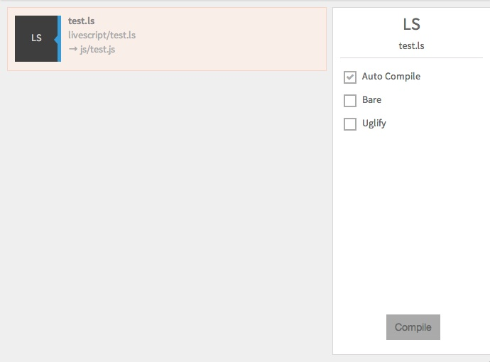

You can compile LiveScript files with Prepros.

If you save LiveScript files in `live` folder the compiled output will be saved in your `js` folder.

You can configure default `css`, `js`, and `html` folders from [project options](projects.html).

You can learn more about LiveScript on [LiveScript website](http://livescript.net).