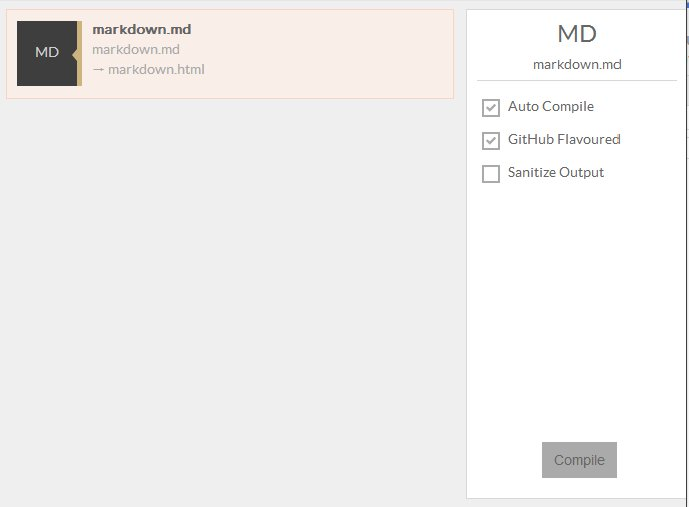

You can compile Markdown files with Prepros.

Prepros also supports GitHub Flavored Markdown.

If you save Markdown files in `markdown` or `md` folder the compiled output will be saved in your `html` folder.

You can configure default `css`, `js`, and `html` folders from [project options](projects.html).

You can learn more about Markdown on [Markdown website](http://daringfireball.net/projects/markdown/) and about GitHub Flavored Markdown [here](https://help.github.com/articles/github-flavored-markdown/).