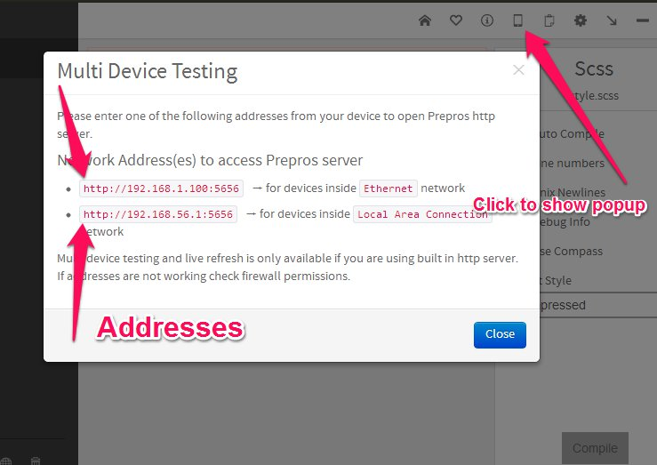

Prepros supports testing your web pages in multiple devices connected to your LAN. Prepros also live refresh all devices whenever you make change to your file.

Please click the `phone` icon on the top right corner of the Prepros window to get the url to Prepros server.

Prepros uses websockets for communication so your device must support it for live refresh to work.

Multi device testing and live refresh is only availabe if you are using built in Prepros server not the custom server.
