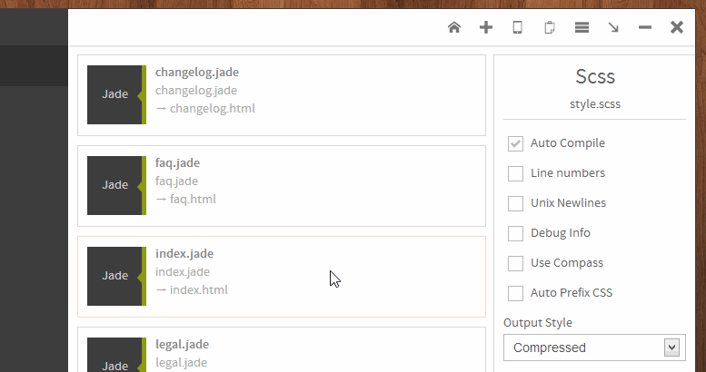
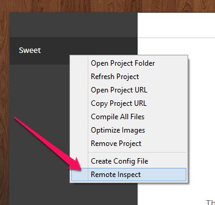
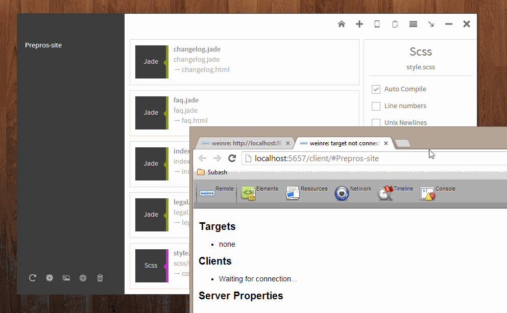

Prepros supports testing your web pages in multiple devices connected to your LAN. Prepros also live refresh all devices whenever you make change to your file.

Please click the `phone` icon on the top right corner of the Prepros window to get the url to Prepros server.

Prepros uses websockets for communication so your device must support it for live refresh to work.

### Inspecting Remote Devices

After you open Prepros url on remote device such as your phone or another device. You can inspect that device with Prepros. To inspect remote devices right click on project and then click `remote inspect` option.

This will open up your browser and will show the devices connected. Select the target device device and go any tab like elements, resourcees, networks etc.

The above gif shows inspecting another tab of chrome but it can be done with remote devices such as phones and tablets.