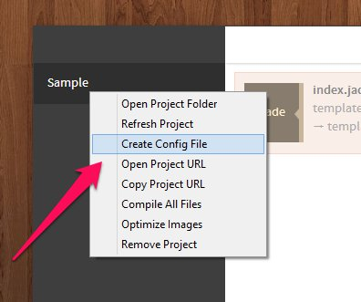

`pepros.json` is a file that stores the settings and file/project information. The file is stored on the root of the project folder. When you remove and re-add the project to Prepros the settings on the `prepros.json` file are read and the settings on file are applied to the files on project. This file can be easily shared to share same settings across teams.

#### Creating Prepro.json File

To create `prepros.json` config file just right click on the project and click on `Create Config File` option.

This will create a new `prepros.json` config file and Prepros will update this file whenever the settings are changed from UI.