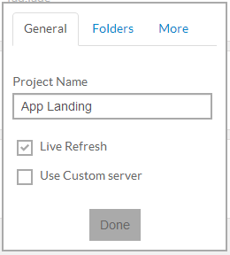

Project is the collection of all your preprocessing files. It can be just your scss, less folder or the project you are working on. Your projects are listed on the left part of the Prepros window

### Adding Project
Adding a new project to Prepros is as easy as pie. There are three ways to add project in Prepros.

__1. Drag &amp; Drop__

This is the easiest way to add project to Project. Just drag and drop your project folder to Prepros window and it will scan through all of your files in your project folder and add pre-process(able) files to watch list.

If you drag and drop a file instead of the folder, The parent folder of the file will be added to project.

__2. Using [ + ] button.__

You can add new project to Prepros by clicking the plus icon located near the bottom left part of Prepros window.

You can also hit `CTRL+N` to add new project

###Project Toolbar

When You select a project on Prepros a toolbar appears next to the `plus` icon. You can use the toolbar to manage your projects options.

__About icons (in the order of image above)__

* Add new project
* Refresh project files
* Project options
* Open [project live url](live-refresh.html)
* Remove project

You must refresh project after adding new file to project folder or importing one file from another file

### Project Options
There are many options availabe to manage your projects. You can open options window by clicking the options button on the project toolbar.

Options window contain the options whch you can use to manage your project options. There are three tabs on project options window.

__1. General__
General tab contains the setting to change your project name and option to enable/disable [live refresh server](live-refresh.html) and use custom server for live refresh.

__2. Folders__
Folders tab contains options to set your default css, js and html folders.
You can also change default options from [options window](config.html) before adding new project.

__3. Filters__
You can exclude certain files from project by adding filter patterns in comma seperated list. You can also add global filters from [options window](config.html).

Don't forget to refresh project after editing filters.

You can double click project name to open project folder in explorer.
