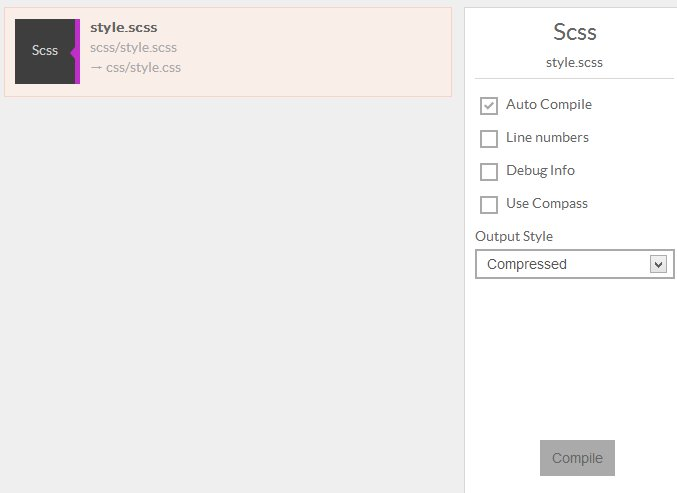
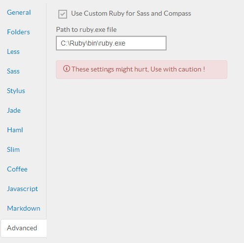

Prepros has full support for Sass and Compass.

If the sass files are saved in `sass/scss` folder the output css is saved to user defined css folder. You can change css folder from [project options](projects.html).

Sass and Scss partials are ignored from files list but they are stil warched if imported by another file.
If any sass, scss file is imported by another file the imported file is not shown in the file list but the file is watched and parent file is compiled whenever the imported file is changed.

You can change various file options from file options panel such as output style.



### Using Compass

Prepros has two modes for compass support.

__1. Compass Css3 mode__

You can use css3 features of compass and also change the output path of file but you can't use advanced compass functions like spriting.

__2. Full Compass support__

In this mode you can use all the features of compass including spriting but you can't change the output path of file from within Prepros.
You have to manage input and output folder by using your compass config.rb file. The config.rb file must be located in the root of your project folder.

### Using third party compass plugins

To use third party compass plugins you have to install sass, compass and your third party plugins in your computer and point prepros to use your system ruby to compile sass and compass. You can then require third plugins from your config.rb file.

To point to the custom ruby go to [options panel](config.html) > advanced tab and check `use custom ruby for sass and compass` checkbox and enter the path to your ruby.exe file.




### Using Bourbon and Neat

[Bourbon](http://bourbon.io) and Neat(http://neat.bourbon.io) come prebundled with Prepros. Just require it on your sass file and you are good to go.

```css
@import 'bourbon';
@import 'neat';

~~ Your Css ~~
```

Boom, it works.