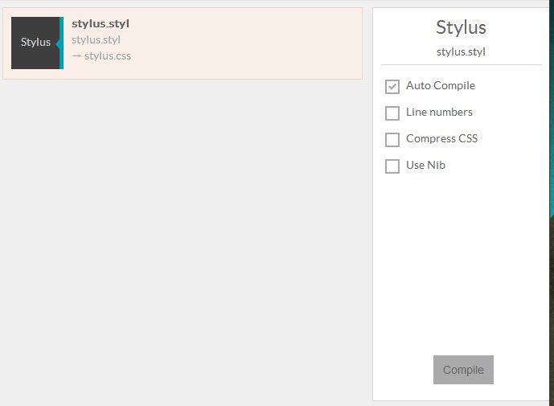

You can compile Stylus files with Prepros.

If you save Stylus files in `styl` or `stylus` folder the compiled output will be saved in your `css` folder.

You can configure default `css`, `js`, and `html` folders from [project options](projects.html).

If a file imports another file the imported file is not shown in the files list but is watched in background and parent file is compiled whenever change is detected.

You can learn more about stylus on [Stylus website](http://learnboost.github.io/stylus/).